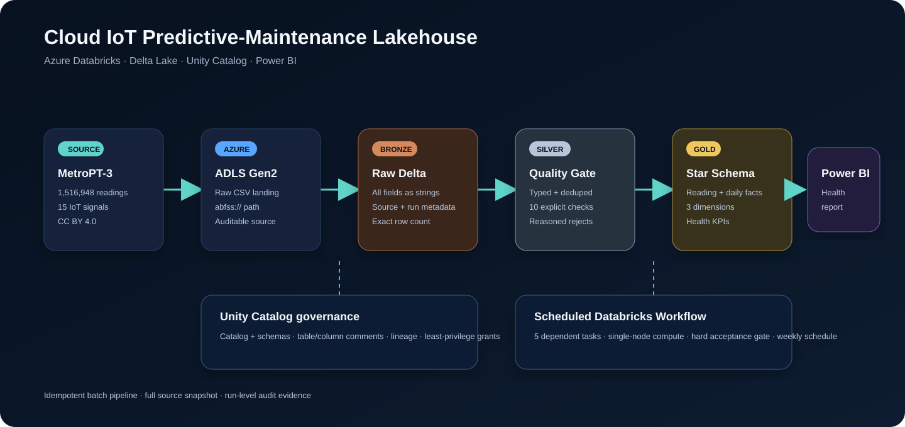
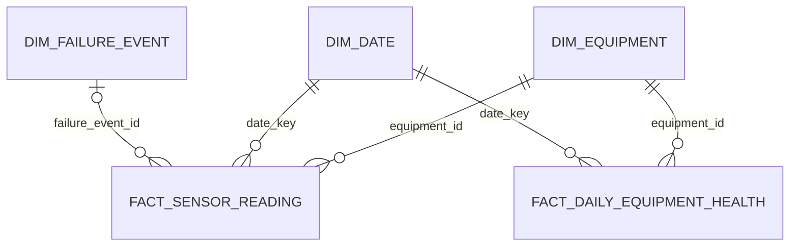
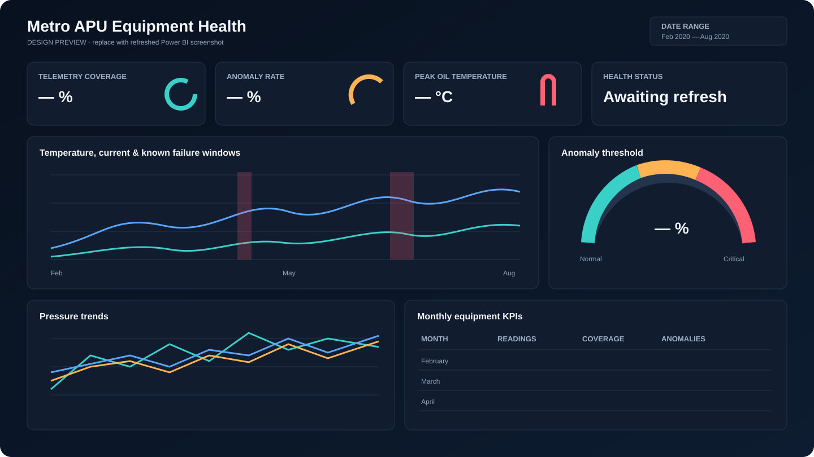

# Uptime Lake

An Azure Databricks lakehouse for predictive maintenance on real urban-transit compressor telemetry. It
lands MetroPT-3 in ADLS Gen2, processes it through Bronze → Silver → Gold Delta tables, rejects invalid rows
with explicit reasons, governs the model in Unity Catalog, and exposes daily equipment-health KPIs to Power BI.



## What is implemented

| Capability | Evidence in this repository |
|---|---|
| Azure landing zone | ADLS Gen2 + managed-identity access connector in `infra/main.bicep` |
| Bronze ingestion | Schema-controlled raw CSV ingest with source, timestamp, and run metadata |
| Silver quality gate | 10 row-level checks, deterministic dedupe, and `sensor_readings_rejects` reasons |
| Gold model | Reading fact, daily KPI fact, equipment/date/failure dimensions, Power BI view |
| Governance | Unity Catalog namespaces, comments, lineage-ready SQL, and optional read-only group grant |
| Orchestration | Five dependent tasks in a scheduled Databricks Asset Bundle workflow |
| Acceptance gate | Count reconciliation, key uniqueness, fact reconciliation, and dimension checks |
| Power BI handoff | Parameterized Databricks query, DAX measures, theme, and report specification |
| Local proof | 22-row adversarial sample exercises every quality rule; 5 automated tests |

The code is complete and locally verified. Cloud-only evidence is deliberately not fabricated: the real green
job run, Unity Catalog lineage/grants, production metrics, and refreshed Power BI screenshot must be captured
from the workspace by following [`docs/evidence-checklist.md`](docs/evidence-checklist.md). Until those files
exist, do not claim the project as deployed on a CV.

## Local validation results

Checked in at [`artifacts/local_validation.json`](artifacts/local_validation.json) and regenerated by
`python scripts/validate_sample.py`. The 22-row adversarial sample is built so every one of the 10 quality
rules fires at least once.

| Metric | Value |
|---|---|
| Source rows | 22 |
| Accepted (Silver) | 12 |
| Rejected | 10 |
| Reconciled (`bronze == silver + rejects`) | Yes |
| Quality rules exercised | 10 / 10 (each rejects exactly 1 row) |
| Sample pass rate | 54.545% |
| Explainable anomaly rows | 4 |

These are the tiny-sample proof numbers, not production scale; the real per-check pass rates come from the
cloud run captured via [`docs/evidence-checklist.md`](docs/evidence-checklist.md).

## Dataset and honest scale

[MetroPT-3](https://archive.ics.uci.edu/dataset/791/metropt+3+dataset) contains **1,516,948 readings** and 15
analogue/digital signals from a metro train Air Production Unit compressor, collected from February through
August 2020. UCI distributes the 208.2 MB CSV under **CC BY 4.0** and publishes four known air-leak intervals.

The original project brief says 15,169,480 readings; that is a tenfold typo. This project uses the source's
real 1,516,948 count and verifies it during download. It does not inflate the number through duplication.

Citation: Davari, N., Veloso, B., Ribeiro, R., & Gama, J. (2021). *MetroPT-3 Dataset*. UCI Machine Learning
Repository. [DOI 10.24432/C5VW3R](https://doi.org/10.24432/C5VW3R).

## Data model



- `bronze.sensor_readings_raw`: exactly as received, with all source fields as strings.
- `silver.sensor_readings`: typed and accepted readings at `(reading_id, event_ts)` grain.
- `silver.sensor_readings_rejects`: rejected rows plus semicolon-delimited `rejection_reason`.
- `audit.quality_check_results`: pass/fail counts for every rule and run.
- `gold.fact_sensor_reading`: full reading grain, failure-window key, and explainable anomaly reasons.
- `gold.fact_daily_equipment_health`: daily coverage, anomaly rate, pressure, temperature, and current KPIs.
- `gold.powerbi_equipment_health`: narrow, dashboard-ready semantic view.

The anomaly flag is an explainable threshold indicator (high oil temperature/current, pressure mismatch, LPS,
or oil-level signal), not a trained prediction model.

## Quality contract

The executable rules live in `src/uptime_lake/quality.py`; `quality/expectations.yml` is the human-readable
contract. A row can carry multiple reasons, so one bad field never hides another.

| Check | Acceptance rule |
|---|---|
| Reading ID | Parses to a non-null integer |
| Timestamp | Parses and falls inside calendar year 2020 |
| Required sensors | All 15 values parse as numbers |
| Pressure | Five pressure signals are between -2 and 20 bar |
| Oil temperature | Between -30 and 150 °C |
| Motor current | Between -1 and 50 A |
| Digital signals | Seven signals are exactly 0 or 1 |
| Caudal impulses | Non-negative |
| Duplicate reading | Retain first `(reading_id, event_ts)`; reject later rows |

Every run additionally proves `bronze = silver + rejects`, Silver keys are unique, and Gold fact rows equal
Silver rows. A failed dataset-level check fails the workflow.

## Run locally in under a minute

No Spark, Java, cloud account, or third-party Python package is needed for the local contract proof.

```powershell
$env:PYTHONPATH = "$PWD/src"
python scripts/validate_sample.py
python -m unittest discover -s tests -v
```

Expected result: 22 source rows reconcile to 12 accepted + 10 rejected; each of the 10 quality rules is
exercised; all 5 tests pass. The checked-in result is `artifacts/local_validation.json`.

## Deploy to Azure Databricks

The exact production path—Bicep provisioning, managed-identity ADLS registration, verified data download,
bundle validation/deployment, run, evidence capture, and cost shutdown—is in
[`docs/deployment.md`](docs/deployment.md).

The workflow defaults to a paused `dev` schedule. The `prod` target unpauses a weekly Sunday run. It uses a
small single-node Azure Databricks cluster with a three-hour timeout and refuses concurrent runs.

```powershell
databricks bundle validate --target dev --var="source_path=<abfss-path>"
databricks bundle deploy --target dev --var="source_path=<abfss-path>"
databricks bundle run metropt_lakehouse --target dev
```

## Power BI



This image is explicitly a design preview, not deployment evidence. `powerbi/` contains the parameterized
ADBC connector query, eight measures, theme, layout, and instructions. Refresh it against
`gold.powerbi_equipment_health`, then replace the preview in the portfolio evidence with the genuine exported
Power BI screenshot. The report uses the already-small daily table in Import mode.

## Repository layout

```text
├── databricks.yml              # Asset Bundle environments and variables
├── resources/job.yml           # five-task scheduled workflow
├── infra/                      # Azure Bicep + Unity Catalog external location
├── notebooks/                  # thin Databricks job entry points
├── src/uptime_lake/            # schemas, quality rules, transforms, validations
├── quality/expectations.yml    # documented data contract
├── data/sample/                # tiny adversarial sample only
├── powerbi/                    # query, DAX, theme, and report specification
├── sql/                        # governance and quantified-result queries
├── docs/                       # architecture, runbook, and evidence checklist
└── tests/                      # fast contract and reconciliation tests
```

## Definition-of-done tracker

- [x] Reproducible Bronze → Silver → Gold implementation
- [x] Ten explicit quality checks and reasoned rejects
- [x] Unity Catalog structure, comments, and grant automation
- [x] Scheduled, unattended Asset Bundle workflow definition
- [x] Gold star schema and dashboard KPIs
- [x] Local acceptance suite and CI workflow
- [ ] Successful production Databricks job screenshot
- [ ] Production row counts/pass rates from the full dataset
- [ ] Unity Catalog lineage and grant screenshots
- [ ] Refreshed Power BI report and screenshot

After those four cloud evidence items are real, a defensible CV bullet is:

> Built an Azure Databricks predictive-maintenance lakehouse over 1.52M MetroPT-3 IoT readings, using ADLS
> Gen2 and a Delta Lake Bronze–Silver–Gold pipeline; enforced 10 automated quality rules with reasoned reject
> routing, governed assets through Unity Catalog, and served equipment-health KPIs to Power BI through a
> scheduled five-task workflow.

## License

Project code is MIT licensed. MetroPT-3 data is not redistributed except for a tiny synthetic-format test
sample created for this repository; obtain the full CC BY 4.0 dataset directly from UCI.
